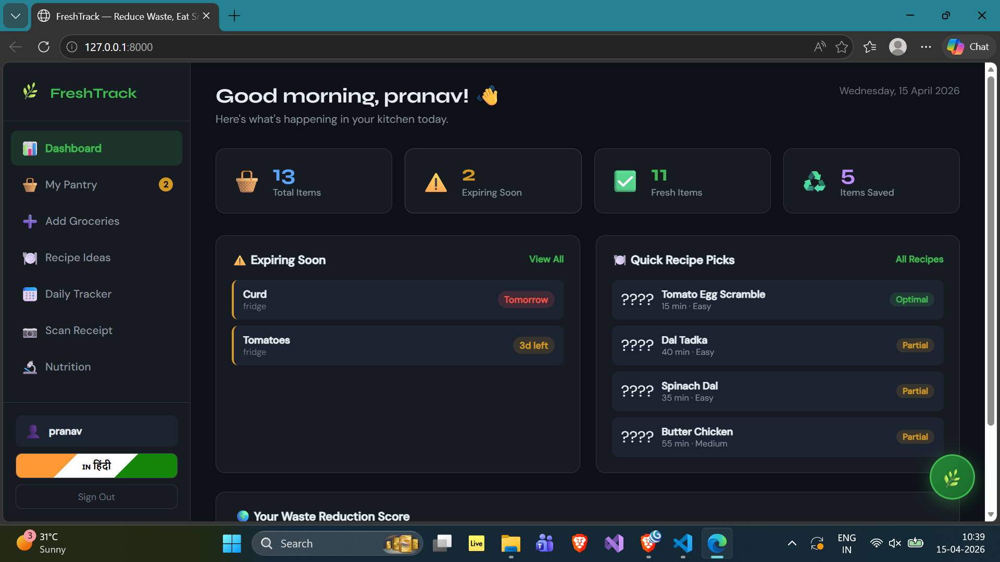
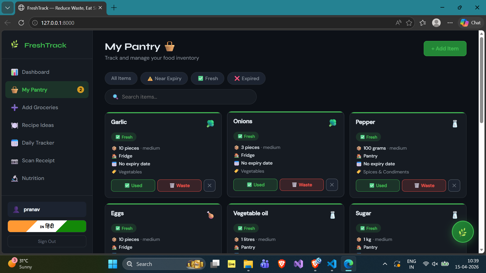
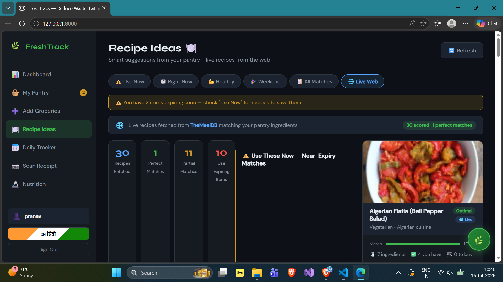

# 🌿 FreshTrack — Food Waste Reduction System

## 📸 Demo Preview

### 🏠 Dashboard


### 🧺 My Pantry


### ➕ Add Groceries


### 🍽️ Recipe Ideas


### 📊 Daily Tracker


### 📊 Nutrients Tracker


---

A full-stack web application built with **Django (Python)** + **MySQL** backend and a custom HTML/CSS/JS frontend to help households track groceries, reduce food waste, and get smart recipe recommendations.

# 🌿 FreshTrack — Food Waste Reduction System

A full-stack web application built with **Django** (Python) + **MySQL** backend and a custom HTML/CSS/JS frontend to help households track groceries, reduce food waste, and get smart recipe recommendations.


## 🚀 Quick Start

### Requirements
- Python 3.10+
- MySQL 8.0+ (or use SQLite for development)
- pip
- django
- djangorestframework
- django-cors-headers
- mysqlclient
- groq
- requests
- python-dotenv

### Installation

```bash
# 1. Clone / extract the project
cd freshtrack_project

# 2. Install dependencies
pip install django djangorestframework django-cors-headers mysqlclient

# 3. Configure MySQL (optional, SQLite works out of box)
# Edit freshtrack_project/settings.py — uncomment the DATABASES block

# 4. Run migrations
python manage.py migrate

# 5. Load sample data
python manage.py loaddata inventory/fixtures/categories.json

# 6. Seed recipes (run this one-time script)
Get-Content seed_recipes.py | python manage.py shell  

# 7. Start the server
python manage.py runserver

# 8. Visit http://localhost:8000
```

## 🗄️ MySQL Setup

```sql
CREATE DATABASE freshtrack_db CHARACTER SET utf8mb4 COLLATE utf8mb4_unicode_ci;
CREATE USER 'freshtrack'@'localhost' IDENTIFIED BY 'your_password';
GRANT ALL PRIVILEGES ON freshtrack_db.* TO 'freshtrack'@'localhost';
FLUSH PRIVILEGES;
```

Then update `settings.py`:
```python
DATABASES = {
    'default': {
        'ENGINE': 'django.db.backends.mysql',
        'NAME': 'freshtrack_db',
        'USER': 'freshtrack',
        'PASSWORD': 'your_password',
        'HOST': 'localhost',
        'PORT': '3306',
        'OPTIONS': {'charset': 'utf8mb4'},
    }
}
```

``` API KEY - Add your key in .env ```

## 📡 API Endpoints

| Method | Endpoint | Description |
|--------|----------|-------------|
| POST | `/api/auth/register/` | Register new user |
| POST | `/api/auth/login/` | Login, returns token |
| POST | `/api/auth/logout/` | Logout |
| GET  | `/api/auth/me/` | Current user profile |
| GET/POST | `/api/inventory/items/` | List / create food items |
| GET  | `/api/inventory/items/?status=near_expiry` | Filter by status |
| GET  | `/api/inventory/items/dashboard_stats/` | Dashboard metrics |
| POST | `/api/inventory/items/{id}/mark_consumed/` | Mark item as used |
| POST | `/api/inventory/items/{id}/mark_wasted/` | Mark item as wasted |
| GET  | `/api/recipes/recommendations/` | Get smart recommendations |
| GET  | `/api/recipes/all/` | List all recipes |

## 🏗️ Architecture

```
freshtrack_project/
├── accounts/          # User auth & profiles
├── inventory/         # Food items, categories, daily logs
│   └── fixtures/      # Category seed data
├── recipes/           # Recipe dataset + recommendation engine
│   ├── engine.py      # ⭐ Core scoring & classification algorithm
│   └── fixtures/      # Recipe seed data
├── templates/
│   └── index.html     # Single Page App shell
└── static/
    ├── css/main.css   # Full design system
    └── js/app.js      # Frontend SPA logic
```

## 🧠 Recommendation Engine (recipes/engine.py)

The engine scores recipes using:

**Score = Base Match + Freshness Bonus + Optional Bonus**

- **Base Match**: `matched_required / total_required` ingredients
- **Freshness Bonus**: +0.15 per near-expiry ingredient used
- **Optional Bonus**: up to 0.10 for optional ingredient matches

**Classification**:
- 🟢 **Optimal**: Score ≥ 0.8 AND no missing required ingredients
- 🟡 **Partial**: Score ≥ 0.5 OR ≤ 2 missing ingredients  
- 🔴 **Low**: Everything else

**Recipe Categories**:
- ⚠️ **Use Now**: Recipes that use near-expiry items (prioritised)
- 🕐 **Right Now**: Time-of-day appropriate (breakfast/lunch/dinner/snack)
- 💪 **Healthy**: Tagged with health benefits
- 🎉 **Weekend**: Weekend special recipes (Sat/Sun only)
- 📋 **All Matches**: All recipes with score ≥ 0.3

## 📊 Database Schema

- **FoodItem**: name, category, quantity, expiry_date, storage_location, freshness_status
- **Recipe**: title, meal_type, health_tags, is_weekend_special, instructions
- **RecipeIngredient**: ingredient name, quantity, is_optional, substitutes (JSON)
- **UserProfile**: waste stats, dietary preferences, streak tracking
- **DailyLog**: daily usage/waste tracking per user
